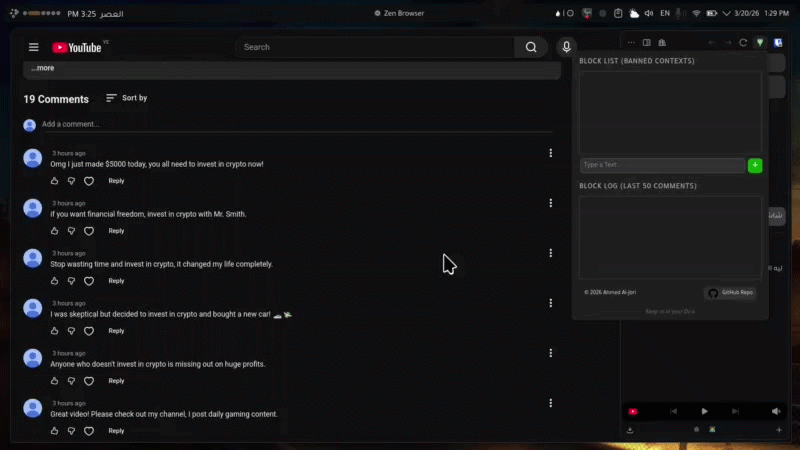

# 🚫 Comment Filter for YouTube

A lightweight, open-source web extension for Firefox, Chrome, and their derivatives, designed to enhance your YouTube viewing experience by hiding annoying, repetitive, or unwanted comments based on custom keywords and contexts you define.

## ✨ Features

* **Fully Custom Contexts:** The extension comes with an empty blocklist, giving you full control to add specific words or phrases that annoy you. You can add unlimited contexts, and everything is stored locally and securely in your browser.
* **Word & Sentence Support:** It doesn't just block single words; it recognizes and blocks entire sentences, even if the spacing between words is irregular or inconsistent.
* **Exceptional Arabic NLP Support:** The filtering engine uses smart Regular Expressions (Regex) tailored specifically for the Arabic language. It detects blocked words even if the user tries to bypass the filter by automatically ignoring:
  * Kashida / Letter stretching (e.g., مــــروم).
  * Diacritics (Tashkeel, Shadda, Madda).
  * Hamza variations (أ, إ, آ, ا).
* **Flawless RTL Support:** The UI is beautifully designed to handle Arabic text and Right-to-Left (RTL) sentences without breaking the layout.
* **Block Log:** A dedicated interface displaying the last 50 hidden comments, allowing you to review the extension's activity and ensure no innocent comments were blocked by mistake.
* **Emoji Blocking:** You can add specific emojis to your blocklist, and any comment containing them will be instantly hidden.
* **Performance Optimized:** The extension operates smartly to maintain browser speed. It tags checked comments invisibly so it only scans *new* comments when you scroll. If you update your blocklist, it immediately re-evaluates all loaded comments and restores those that are no longer flagged.
* **Ignores Pinned Comments:** Since pinned comments are usually selected by the creator and contain important context, they are intentionally bypassed by the filter.

## ‼️ Limitations (Currently)

* **Mobile Web:** Does not work on the mobile version of YouTube (`m.youtube.com`) due to a different DOM structure.
* **Links & Mentions:** Does not filter out raw URLs or user mentions.
* **Heart Emojis (and Complex Emojis):** While the extension generally supports emoji blocking, trying to block specific "heart emojis" (or combined multi-character emojis) might occasionally cause minor glitches or inaccuracies. This is due to the complex way modern browsers handle the Unicode encoding for these specific symbols.

## 🛠️ Tech Stack
 - **HTML / CSS:** For styling the extension's popup interface.
- **JavaScript (Vanilla):** For the core logic and filtering engine and popup logic.
- **Extension API (Manifest V3):** For browser integration and secure local storage management.

---

## 💾 Installation

### For FireFox (Floorp / Zen / LibreWolf / Waterfox)
* **Official Store:** Install it directly from the [Official Firefox Add-ons Store](https://addons.mozilla.com/en-US/firefox.addon/comment-filter.).
* **Manual Installation:**
  1. Download the extension (`.zip` file) from the [Releases tab](https://github.com/al-jbri/comment-filtter/releases/).
  2. Open a new tab and navigate to `about:debugging#/runtime/this-firefox`.
  3. Click on **Load Temporary Add-on**.
  4. Select the downloaded `.zip` file.

### For Chrome (Arc / Brave / Opera / Edge)
*Since the extension is not currently available on the Chrome Web Store, you can easily install it manually:*
1. Download the extension from the [Releases tab](https://github.com/al-jbri/comment-filtter/releases/) and extract the `.zip` file into a folder.
2. Open a new tab and navigate to `chrome://extensions`.
3. Enable **Developer mode** in the top corner.
4. Click **Load unpacked** and select the extracted folder.
